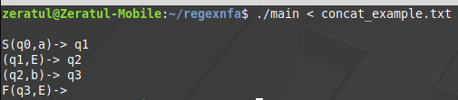
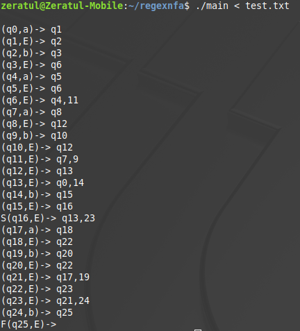

# Regex to NFA 

This program reads from STDIN a series of characters representing the alphabet of a finite automaton (a,b,c,d,e) and 
the characters representing regular expression operations (concatenation: &, kleene star: *, union: |), creating a 
corresponding NFA.
 

Parsing and error checking exists to make sure the expression is complete. The NFA is constructed piecemeal using a stack
which builds smaller NFAs into larger ones until only one remains on the stack.
 

The program prints the transition functions for each node in the NFA before terminating.
 

The input must be in postfix notation.
 

## Examples

This is the NFA representation of a&b (a concatenated with b), presented in postfix notation as ab&.
 
S denotes the beginning state. F denotes the final state.
 

Complexity is limited only by the given alphabet, operations, and machine memory.

## Compilation
"make" produces a "main" executable file.
